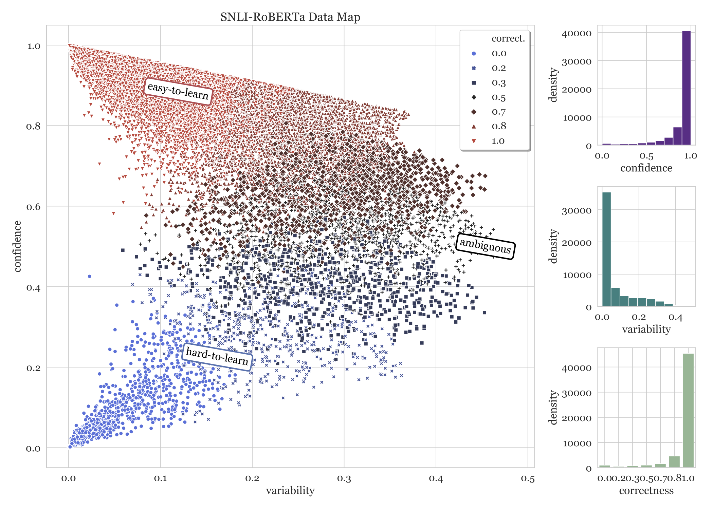

# Dataset Cartography

Code for the paper [Dataset Cartography: Mapping and Diagnosing Datasets with Training Dynamics](https://arxiv.org/abs/2009.10795) at EMNLP 2020.

This repository contains implementation of data maps, as well as other data selection baselines, along with notebooks for data map visualizations.

If using, please cite:
```
@inproceedings{swayamdipta2020dataset,
    title={Dataset Cartography: Mapping and Diagnosing Datasets with Training Dynamics},
    author={Swabha Swayamdipta and Roy Schwartz and Nicholas Lourie and Yizhong Wang and Hannaneh Hajishirzi and Noah A. Smith and Yejin Choi},
    booktitle={Proceedings of EMNLP},
    url={https://arxiv.org/abs/2009.10795},
    year={2020}
}
```
This repository can be used to build Data Maps, like [this one for SNLI using a RoBERTa-Large classifier](./sample/SNLI_RoBERTa.pdf).


### Pre-requisites

This repository is based on the [HuggingFace Transformers](https://github.com/huggingface/transformers) library.
<!-- Hyperparameter tuning is based on [HFTune](https://github.com/allenai/hftune). -->


### Train GLUE-style model and compute training dynamics

To train a GLUE-style model using this repository:

```
python -m cartography.classification.run_glue \
    -c configs/$TASK.jsonnet \
    --do_train \
    --do_eval \
    -o $MODEL_OUTPUT_DIR
```
The best configurations for our experiments for each of the `$TASK`s (SNLI, MNLI, QNLI or WINOGRANDE) are provided under [configs](./configs).

This produces a training dynamics directory `$MODEL_OUTPUT_DIR/training_dynamics`, see a sample [here](./sample/training_dynamics/).

*Note:* you can use any other set up to train your model (independent of this repository) as long as you produce the `dynamics_epoch_$X.jsonl` for plotting data maps, and filtering different regions of the data.
The `.jsonl` file must contain the following fields for every training instance:
- `guid` : instance ID matching that in the original data file, for filtering,
- `logits_epoch_$X` : logits for the training instance under epoch `$X`,
- `gold` : index of the gold label, must match the logits array.


### Plot Data Maps

To plot data maps for a trained `$MODEL` (e.g. RoBERTa-Large) on a given `$TASK` (e.g. SNLI, MNLI, QNLI or WINOGRANDE):

```
python -m cartography.selection.train_dy_filtering \
    --plot \
    --task_name $TASK \
    --model_dir $PATH_TO_MODEL_OUTPUT_DIR_WITH_TRAINING_DYNAMICS \
    --model $MODEL_NAME
```


### Data Selection

To select (different amounts of) data based on various metrics from training dynamics:

```
python -m cartography.selection.train_dy_filtering \
    --filter \
    --task_name $TASK \
    --model_dir $PATH_TO_MODEL_OUTPUT_DIR_WITH_TRAINING_DYNAMICS \
    --metric $METRIC \
    --data_dir $PATH_TO_GLUE_DIR_WITH_ORIGINAL_DATA_IN_TSV_FORMAT
```

Supported `$TASK`s include SNLI, QNLI, MNLI and WINOGRANDE, and `$METRIC`s include `confidence`, `variability`, `correctness`, `forgetfulness` and `threshold_closeness`; see [paper](https://arxiv.org/abs/2009.10795) for more details.

To select _hard-to-learn_ instances, set `$METRIC` as "confidence" and for _ambiguous_, set `$METRIC` as "variability". For _easy-to-learn_ instances: set `$METRIC` as "confidence" and use the flag `--worst`. 
